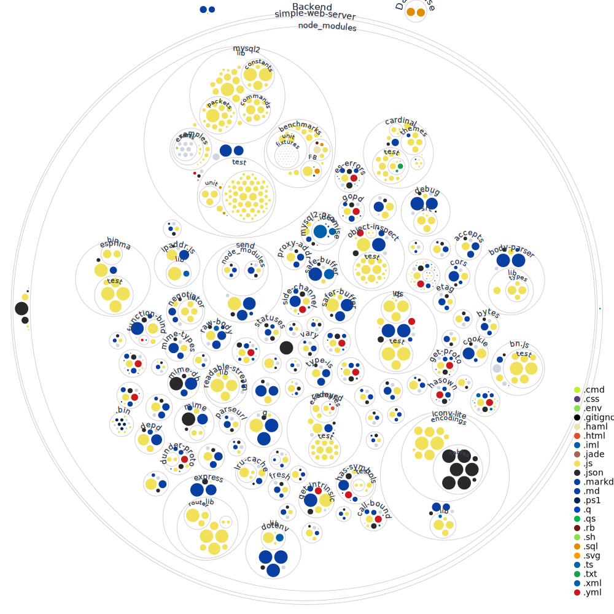

# Opendeurspel2025

## Technov Quiz App 

### De visie 

Een applicatie waar gebruikers op een eenvoudige manier een quiz kunnen aanmaken en delen met andere gebruikers. 
Use-case: 

Een deelnemer van de quiz komt binnen en maakt een account aan (naam en eventueel email). 
Na het aanmaken wordt een driecijferige code gegenereerd. 
De deelnemer gaat naar een lokaal om een vraag te beantwoorden. Met behulp van de code wordt de deelnemer geïdentificeerd. Het antwoord van de deelnemer wordt dan doorgestuurd naar de server op basis van de code. 

Na de hele toer van de school te hebben gedaan, gaat de deelnemer naar de computer met een printer. De deelnemer voert zijn code in en drukt zijn diploma met zijn score af. 

Origineel project in Python: PiotrMazurekTechnOV/Opendeurspel (github.com) 

Versie 2 project 2024: https://github.com/PiotrMazurekTechnOV/Opendeurspel2024

### Team met initiële taken 

- Database 

- Vraagprogramma 

- Adminprogramma 

- API 

 

## Need-to-have’s 

(wat er in de webapp moet zitten) 

### Gebruiker (die een quiz aanmaakt) moet: 

kunnen registreren en inloggen 

een multiple-choice quiz kunnen aanmaken 

de resultaten van alle deelnemers (algemeen en per vraag) kunnen raadplegen 

### Gebruiker (die aan een quiz deelneemt) moet: 

een quiz starten waarbij een code gegenereerd wordt 

met behulp van een code deelnemen aan een quiz zonder in te loggen 

### De applicatie moet: 

de score van deelnemers van een quiz bijhouden 

een proper, duidelijk en gebruiksvriendelijk interface hebben 

diploma afhankelijk van de score 

## Nice-to-have’s 

(uitbreidingen) 

tijdslimiet per vragen (afhankelijk vanaf hoe snel een vraag wordt beantwoord is de score hoger, indien die correct is) 

Authenticatie 

Websocket realtime aanpassen van vragen

 

## Technisch 

### Adminprogramma: 

Toevoegen/verwijderen/aanpassen van vragen (tekst, multiple choice) 

Antwoorden en scores van deelnemers doorlopen/aanpassen 

### Vraagprogramma: 

Bij opstart: instellen van de vraag 

Code vragen van de deelnemer  

Vraag tonen met antwoordmogelijkheid 

Verzenden van de antwoord 

### Printprogramma

Een deelnemer vult zijn code in en drukt op print

### Serverprogramma: 

Databaseserver met tabellen: users, scores, questions, answers, locations  

API die http-requests ontvangt en de SQL-queries laat uitvoeren op de databaseserver (nodejs + mysql)

### Documentatie: 

Http-request (endpoints) 

Database structuur 

Instructies voor deelnemers 

Alles wordt geupload naar github 

## Workflow
GHD = Github Desktop

Kijk of je in de correcte branch zit: GHD -> current branch

Voordat je een project opent: GHD -> fetch origin -> pull

Als je klaar bent met een stuk code:
- in GHD zul je je aanpassingen zien 
- geef een uitleg van wat er is aangepast
- commit
- push naar je branch

Na een paar commits:
- pull request naar branch
- druk op current branch -> pull requests -> create a pull request
- github in browser wordt geopend en druk op create pull request

## Documentatie Database Import

- Open Mysql Workbench
- Druk op Administration en klick op data import
- Selecteer import van self-contained file
- Selecteer het bestand en export

[View interactive Diagram](https://octo-repo-visualization.vercel.app/?repo=integerman%2FVisualizingCode)